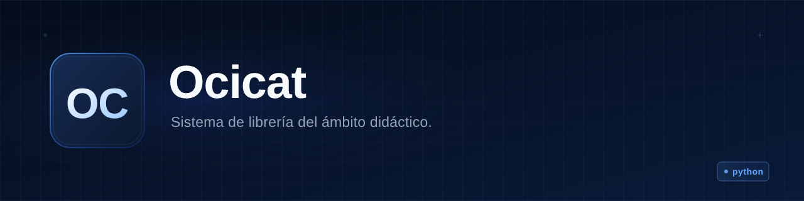

<p align="center">
  
</p>

<h1 align="center">Ocicat</h1>

<p align="center"><b>A Django web application for a teaching-oriented library, with per-record check digits to detect tampering.</b></p>

<p align="center">
  
  
  
  
</p>

---

## What is it

Ocicat is a server-rendered Django application that implements a small library/publications
system for an academic setting. Users log in, browse a feed of publications (with a carousel,
search and filtering by category/date ordering), publish new entries with attached files
(cover image plus media), and delete their own publications. All data lives in SQLite and is
managed through Django's admin as well as the web UI.

Its distinguishing feature is a **check-digit (DV, *dígito verificador*) integrity layer**: every
`USUARIO`, `MEDIA`, `CATEGORIA` and `PUBLICACION` row stores an integer check digit computed by
summing the character codes of its fields. A `DIGITOS_VERIFICADORES` table aggregates the per-row
digits of each table, so the system can verify at any moment that a table was not modified outside
the application (e.g. by editing the SQLite file directly).

**In one sentence:** a Django + SQLite library site for a class project, where every record carries
a checksum to prove the database wasn't touched by hand.

## Status

| | |
|---|---|
| **Status** | Inactive / abandoned prototype (university coursework) |
| **Last code activity** | 2024-11 (`Fixing some things`); only a docs commit afterwards, 2026-09 |
| **Usable today** | Partly: it runs with `python manage.py runserver`, but it was never finished |
| **Missing** | No `requirements.txt`, no deployment story, no tests of substance, plaintext passwords, `DEBUG = True` |
| **Known risks / debt** | See "Notes and decisions" below |

## Why it exists

It was built as university coursework (commits from Oct–Nov 2024, in Spanish, with classmates'
contributions — e.g. the carousel). The check-digit scheme suggests the assignment involved
database integrity concepts. It was never intended for production use, and the code shows it.

## Installation and usage

Requirements: Python 3.11+ and Django 4.2.x. The repo does **not** include a
`requirements.txt`; the only third-party dependency is Django itself.

```bash
pip install "Django~=4.2"
# the repo ships with db.sqlite3; to start from scratch instead:
python manage.py migrate
python manage.py createsuperuser   # for the Django admin at /admin/
python manage.py runserver
```

Then open `http://127.0.0.1:8000/` — main page with the publication feed; `/login_page` to
log in; `/admin/` for the Django admin. An example database (`db.sqlite3`) is included in the
repo, so `runserver` alone may work out of the box.

> Note: these commands were not executed by whoever wrote this README (no Django environment
> was available at the time); they are the standard Django flow for this project layout.

## Stack

- **Language / runtime:** Python 3 (49 `.py` files), Django 4.2.12 (per generated settings header)
- **Database:** SQLite (`db.sqlite3` committed to the repo)
- **Frontend:** server-side Django templates, plain CSS and two small JS files; SVG icons
- **Auth:** custom (not Django's `auth`): passwords stored in **plaintext** in the `USUARIO` table
- **What it deliberately does NOT use:** no REST framework, no frontend framework, no external
  services — everything is server-rendered, consistent with a class assignment

## Architecture

Five Django apps under one project:

```
models/                  all data models + check-digit logic (USUARIO, PUBLICACION, MEDIA, CATEGORIA, DIGITOS_VERIFICADORES)
login_endpoints/         POST /login            — custom login against the USUARIO table
publication_endpoints/   POST /publication, /publication_delete
other_endpoints/         /categoria            — category creation
pages/                   views + templates: home feed, login page, publication page (get/post), filter, DV viewer, 404
ocicat/                  project settings/urls (SQLite, MEDIA at repo root)
```

```
browser → pages (HTML) → endpoints (POST actions) → models (SQLite + DV verification)
```

## Repo structure

```
db.sqlite3                 example database, committed
manage.py                  Django entry point
ocicat/                    project settings and root URLconf
models/                    data models, migrations, check-digit (DV) logic
login_endpoints/           login endpoint
publication_endpoints/     create/delete publication endpoints
other_endpoints/           category endpoint
pages/                     views, templates, CSS/JS/static images
media/                     uploaded/example files
docs/overview.md           auto-generated overview (2026-09)
```

## Notes and decisions

- **Check digits instead of a hash:** DVs are simple sums of `ord()` character codes, not
  cryptographic hashes. They detect naive manual edits to the SQLite file, nothing stronger.
- **Custom auth with plaintext passwords** (`contrasena = CharField`). Fine for a class demo;
  never deploy this as-is.
- **Django's built-in `auth` is installed but unused** for the site's own login — the commit
  `No se puede hacer lo de https ni lo de cookies` (2024-10-22) suggests session/cookie handling
  hit a wall and a simpler custom scheme was chosen.
- **`db.sqlite3` is committed**, so the app works immediately after clone, but migrations history
  and DB state can drift.
- `DEBUG = True` and `ALLOWED_HOSTS = ["*"]` in settings — development-only. A commit notes that
  a proper 404 page requires disabling debug, which would then need a real static-file server.
- The 2026-09 commit (`docs: README + overview generados`) only added auto-generated docs; the
  previous README was that generated stub, so this document is a full rewrite, not an edit.

## License

No license file. Treat as private/all-rights-reserved by the author.

---

*Banner and icon in `assets/` are generated artwork for this documentation, not part of the
original application.*
